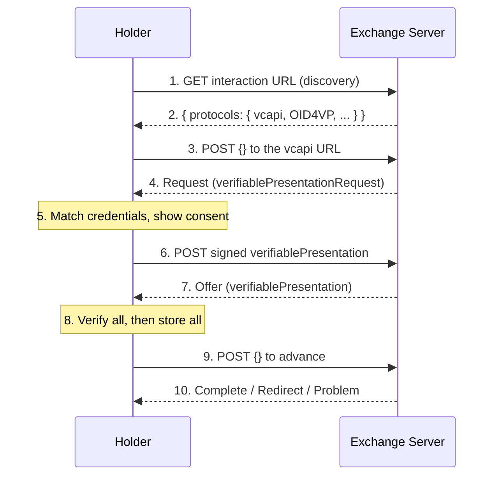

# VCALM for Rust

This library provides a Rust implementation of the **holder** side of VCALM —
Verifiable Credential API Lifecycle Management — the `vcapi` exchange protocol
defined by [VC API][vcapi].

It owns the protocol: the exchange state machine, QueryByExample matching,
verifiable-presentation assembly, and offer classification. It does **not** own
credential storage, key custody, or JSON-LD verification — those come from the
embedding wallet through three traits.

[vcapi]: https://w3c-ccg.github.io/vc-api/

Requires Rust 1.85+ (edition 2024). All other dependencies resolve from
crates.io.

## Holder Usage

Implement the three ports over your wallet, then drive the exchange:

```rust
use std::sync::Arc;
use vcalm_rs::holder::VcalmHolder;
use vcalm_rs::exchange::StepResult;

let holder = VcalmHolder::new_session(
    store,          // Arc<dyn VcalmCredentialStore<Credential = Arc<MyCredential>>>
    vec![],         // trusted DIDs (forward-looking)
    signer,         // Arc<dyn VcalmSigner>
    context_map,    // Option<HashMap<String, String>> -- your bundled JSON-LD contexts
).await?;

// Optionally seed the matcher from the host's own wallet, instead of the store.
holder.provide_credentials(wallet_credentials).await;

let mut step = holder.clone().start_exchange(scanned_url, None).await?;

loop {
    step = match step {
        // The verifier wants a presentation.
        StepResult::Request { .. } => {
            let matched = holder.matched_credentials().await?;
            let fields = holder.requested_fields().await?;   // for the consent UI
            let selected = user_selects(matched, fields);
            holder.clone().submit_presentation(selected, false).await?
        }
        // The issuer offered credentials.
        StepResult::Offer { .. } => {
            let preview = holder.offered_credentials().await?;
            if user_accepts(preview) {
                holder.clone().accept_offer().await?
            } else {
                holder.clone().reject_offer().await?
            }
        }
        // Terminal.
        StepResult::Redirect { url } => break follow(url),
        StepResult::Complete => break,
        StepResult::Problem { details } => break show(details),
    };
}
```

## Protocol Overview

A simplified walk through the `vcapi` exchange, naming the types and methods
that implement each step.

### Initiation (§3.7)

1. *Interaction*: the holder scans an `interaction:<url>` QR code, or
   a bare `http(s)` URL carrying `?iuv=1`.
2. *Protocol discovery*: [`discover_protocols`] GETs that endpoint and returns
   the advertised `protocols` map. 
3. *Start*: `VcalmHolder::start_exchange` resolves the exchange URL and POSTs an
   empty `{}` message.

All discovery code is in the [`discover_protocols`] module.

### Exchange loop (§3.6)

4. Each reply is mapped to a [`StepResult`] by `exchange::classify`, based on 
   field-presence: `verifiablePresentation` (Offer) →
   `redirectUrl` (Redirect) → `verifiablePresentationRequest` (Request) →
   `Complete`.
5. The server's `referenceId` is echoed on the next request.

### Presentation (§3.4)

6. *Matching*: `matched_credentials` runs QueryByExample — type, `@context` and
   recursive `credentialSubject` subset matching — over the store, per query.
7. *Consent*: `requested_fields` reports the fields each query's `example` names,
   for display. It is informational; `ecdsa-rdfc-2019` reveals the whole
   credential.
8. *Submission*: `submit_presentation` assembles a presentation, and signs it. 
   The proof binds the VPR `challenge` and `domain` with `ProofPurpose::Authentication`.

Selective disclosure activates on two gates: the VPR lists `ecdsa-sd-2023`
**and** the matched credential carries a derivable base proof. When both hold,
only the fields that credential's own queries named are revealed.

### Issuance (§3.6.5)

9. *Preview*: `offered_credentials` verifies each offered VC read-only and
   surfaces an [`OfferedValidity`] value.
10. *Accept*: `accept_offer` verifies **every** credential first. Any proof
    failure aborts the whole offer and stores nothing; a valid-but-expired
    credential is still stored, with a distinct warning.
11. *Reject*: `reject_offer` advances without storing.

## Protocol Flow Diagram



## Testing

```bash
cargo test
cargo clippy --all-targets -- -D warnings
```
